# 🎬 GreenFlix

GreenFlix, ASP.NET Core MVC ile geliştirilmiş bir film kataloğu uygulamasıdır. Kullanıcılar film listelerini görebilir, detaylarını inceleyebilir ve izledikleri filmleri kaydedebilir.

---

## 🚀 Özellikler

- 🔐 Giriş yapma & yetkilendirme (admin paneli)
- 🎞️ Film ekleme, düzenleme ve detay görüntüleme
- 📁 Poster yükleme (dinamik dosya upload)
- ✅ İzlenen filmleri listeleme
- ⭐ Filmleri favorilere ekleyebilme
- 💬 Yorum yapma (her film için kullanıcı yorumları)
- 📊 Entity Framework Core ile veri yönetimi
- 🧭 Razor tabanlı dinamik arayüz
- 🌐 Bootstrap ile responsive tasarım

---

## 🖼️ Ekran Görüntüleri
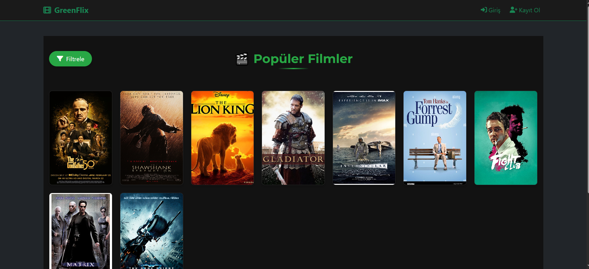
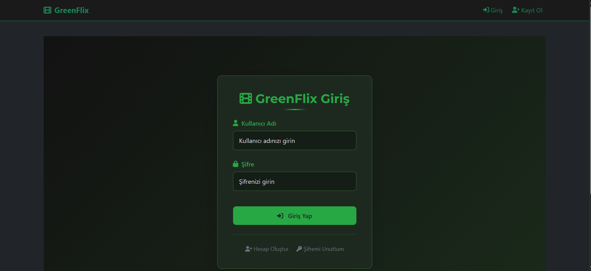
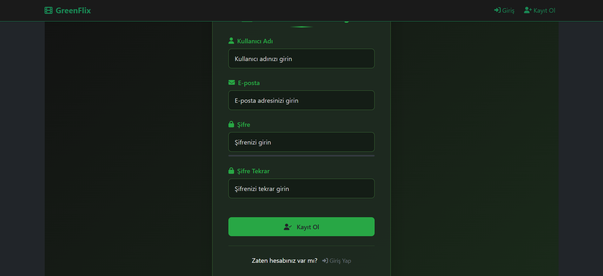
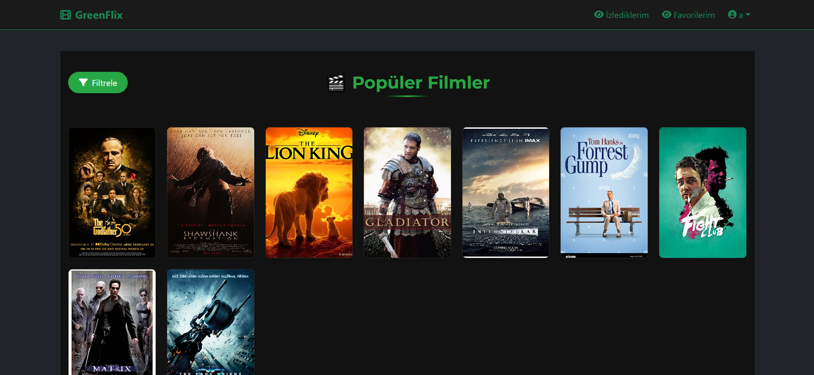

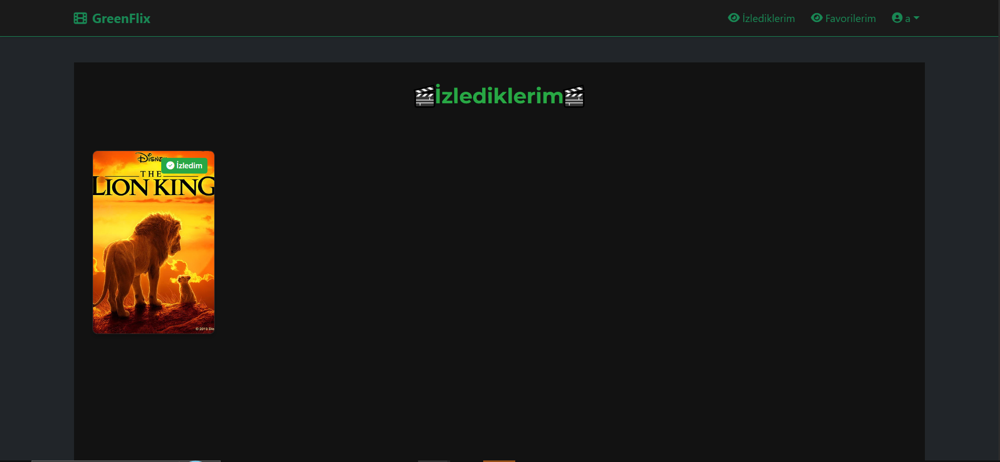

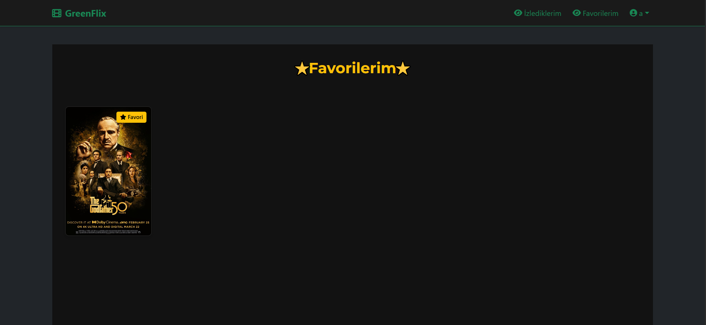
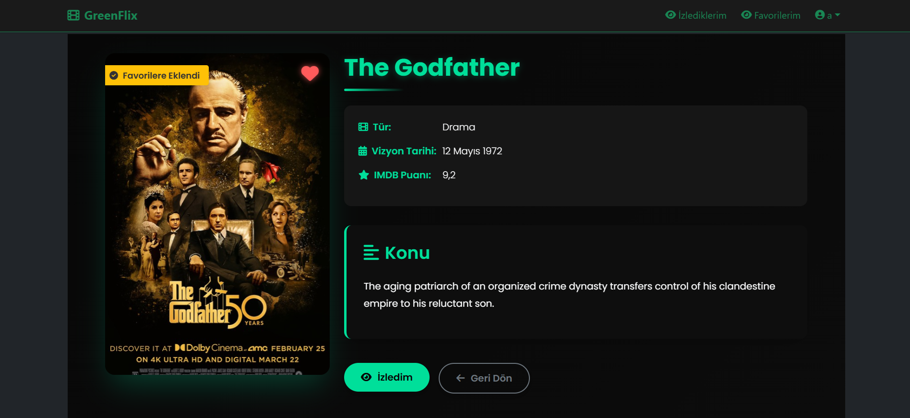
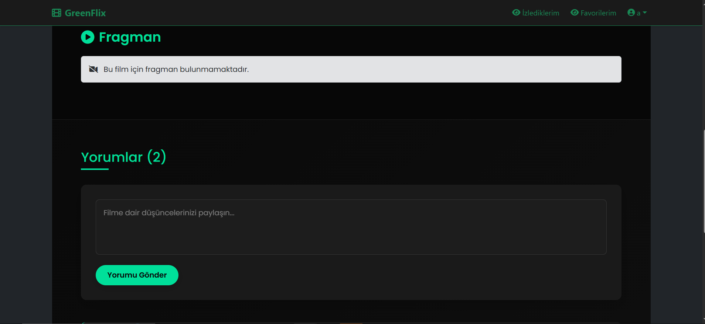
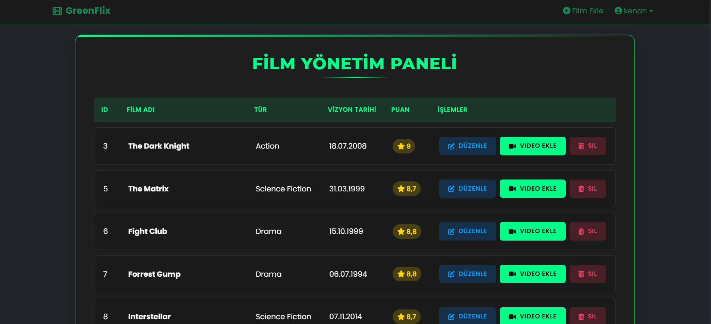
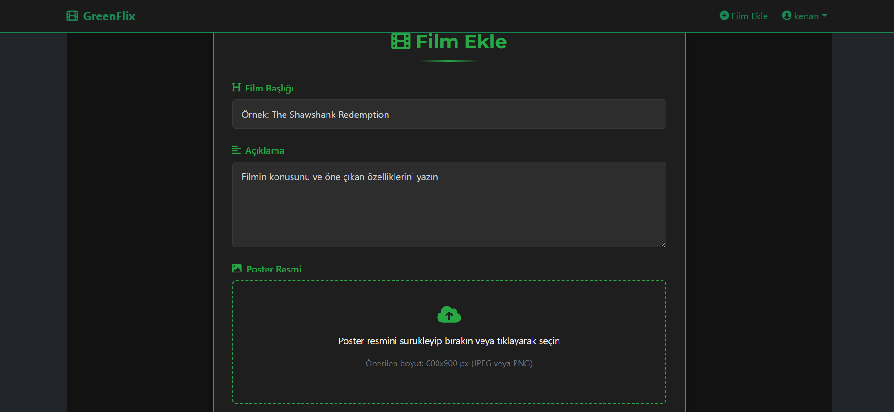
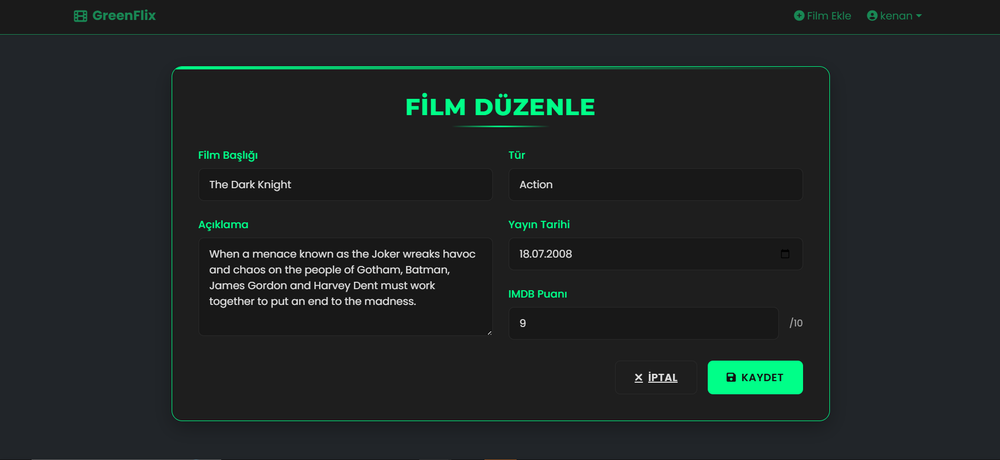

---

## 🧱 Teknolojiler

| Katman              | Teknoloji                  |
|---------------------|----------------------------|
| Backend             | ASP.NET Core MVC           |
| ORM                 | Entity Framework Core      |
| Veritabanı          | SQL Server                 |
| Kimlik Doğrulama    | Cookie Authentication      |
| Arayüz              | Razor + Bootstrap 5        |
| Geliştirme Ortamı   | Visual Studio 2022+        |

---

## 🔧 Kurulum

```bash
# 1. Repo'yu klonla
git clone https://github.com/kullaniciadi/greenflix.git

# 2. Proje klasörüne gir
cd greenflix

# 3. Gerekli NuGet paketlerini yükle (VS açınca otomatik yapılır)

# 4. Migration oluştur (ilk sefer için)
dotnet ef database update

# 5. Uygulamayı çalıştır
dotnet run
